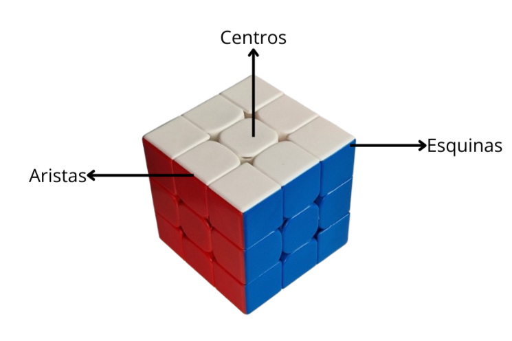

# Introducción

Antes de empezar a resolver el cubo de Rubik, es importante conocer las partes del cubo y las notaciones que se utilizan para describir las movimientos de las caras.

## Partes del cubo
El cubo de Rubik está formado por 26 piezas, que se pueden clasificar en tres tipos:
- 6 piezas centrales o **centros**: son las piezas que forman las caras del cubo y no se pueden mover.
- 12 piezas de los bordes o **aristas**: son las piezas que forman los bordes del cubo y se pueden mover.
- 8 piezas de los vértices o **esquinas**: son las piezas que forman los vértices del cubo y se pueden mover.

Por otra parte, el cubo se puede dividir por capas de la siguiente manera:

## Movimientos

Se considera movimiento del cubo a un giro en sentido horario o antihorario de una de sus caras. Para la notación de los mismos, se debe elegir una cara como cara frontal de manera que esta sea la cara que tienes delante cuando estás mirando al cubo.

Los giros en sentido horario se denotan con las letras mayúsculas de su nombre en inglés:
- F (front): cara frontal
- R (right): cara a la derecha de la cara frontal
- L (left): cara a la izquierda de la cara frontal
- B (back): cara opuesta a la cara frontal
- U (up): cara superior
- D (down): cara inferior

Por otra parte, para los giros en sentido antihorario se emplean las mismas letras en mayúsculas pero con un apóstrofe (') para diferenciarse de las anteriores.

Cuando se hace 2 veces el mismo movimiento se denota con el número dos delante de la letra que hace referencia al movimiento. Una secuencia ordenada de movimientos se llama algoritmo. Por ejemplo, 2F que significa hacer 2 veces F o F', ya que se llega al mismo resultado.

Definida la notación, se puede empezar a resolver el cubo.