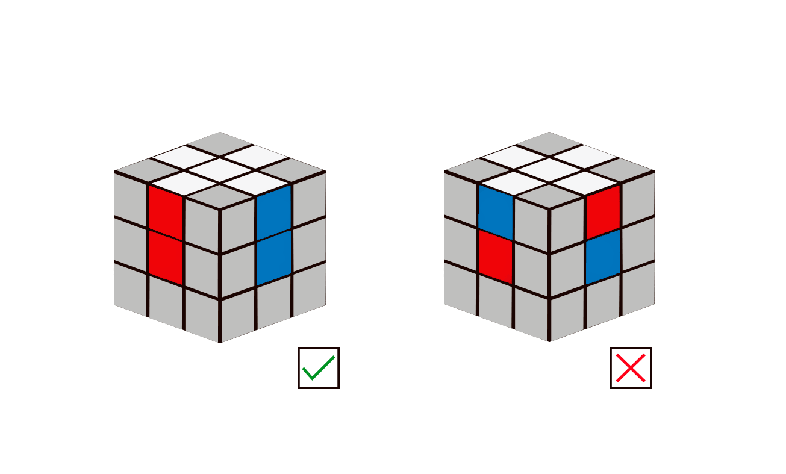
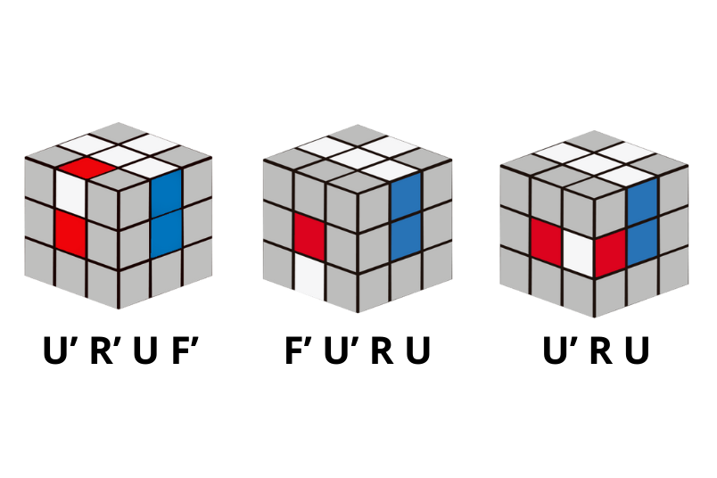

# La cruz en la cara superior

El primer paso es elegir la cara por la que vamos a empezar porque esta será nuestra cara superior y la primera que vamos a hacer. Normalmente se empieza por la cara blanca, aunque se puede elegir cualquier otra.

En este paso, nuestro objetivo es formar una cruz en la cara superior con las aristas de esta bien orientadas y colocadas, es decir, que cada arista de la cara superior coincida con su respectivo centro como en la imagen sigiente.

 En esta etapa no se requiere el uso de un algoritmo específico. Se recomienda
 resolverla de forma intuitiva, ya que este enfoque facilita la familiarización con
 los movimientos básicos del cubo.

 A pesar de no tener algoritmos, se pueden dar ciertos casos que se detallan a
 continuación donde la cara frontal es la cara roja.

 